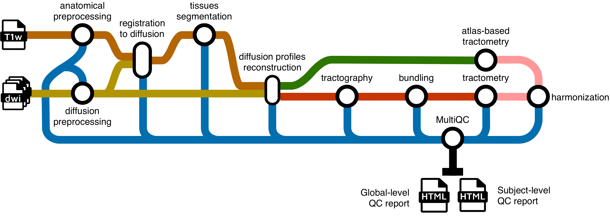

import CommandOutputs from '../../../components/CommandOutputs.astro';
import TroubleshootingSection from '../../../components/TroubleshootingSection.astro';
import { Tabs, TabItem } from '@astrojs/starlight/components';
import { FileTree } from '@astrojs/starlight/components';
import { Steps, Aside } from '@astrojs/starlight/components';



## **Running the pipeline**

The typical command for running the pipeline locally is as follows:

<Tabs>
  <TabItem label="Command">
    ```bash
    nextflow run scilus/sf-tractomics -r <release_version> \
      --input <input_directory> \
      --outdir ./results \
      -profile docker,full_pipeline \
      -with-report <report_name>.html \
      -resume
    ```
  </TabItem>
</Tabs>

This will launch the pipeline with the `docker` and the `full_pipeline` configuration profiles, which automatically spawns docker containers when necessary and runs all the possible diffusion MRI processing steps respectively.

<Aside type="caution">
   If you're trying to run the pipeline running on an HPC cluster and you haven't downloaded and installed the containers to run the pipeline offline, we suggest doing so here before running the pipeline.

   Once you have pre-installed the containers, do not forget to specify the following environment variables so that nextflow can appropriately find the installed containers/images.
   ```bash
   export APPTAINER_CACHEDIR=/scratch/${USER}/sf-tractomics-containers
   export NXF_APPTAINER_CACHEDIR=/scratch/${USER}/sf-tractomics-containers/cache
   export SINGULARITY_CACHEDIR=${APPTAINER_CACHEDIR}
   export NXF_SINGULARITY_CACHEDIR=${NXF_APPTAINER_CACHEDIR}
   ```
</Aside>

<Steps>
  1. **`--input`**: the path to your BIDS directory

     For more details on how to organize your input folder, please refer to the [inputs section](/sf-tractomics/guides/inputs).

  2. **`--outdir`**: path to the output directory

     We do not specify a default for the output directory location to ensure that users have total control on where the output files will be stored,
     as it can quickly grow into a large number of files. The recommended naming would be something along the line of `sf-tractomics-v{version}` where
     `{version}` could be `0.1.0` for example.

  3. **`-profile`**: profile(s) to be run and container system to use

     This is a core `nextflow` argument. `sf-tractomics` processing steps was designed in profiles, giving users total control on which type of processing they want to make. One caveat is that users need to explicitly tell which profile to run. This is done via the `-profile` parameter.
     
     Multiple profiles can be specified at once by separating them with **only a comma and no whitespace** (important!). To choose the appropriate profile(s) for your needs, please see [this section](#choosing-a-profile).

  4. **`-with-report`**: Enables `nextflow` caching capabilities.

     This is a core `nextflow` argument. It enables the creation of a *html report* of the pipeline execution. This report includes some basic metrics about a pipeline run. For more details, see the [core `nextflow` arguments section](#core-nextflow-arguments).

  5. **`-resume`**: Enables `nextflow` caching capabilities.

     This is a core `nextflow` argument. It enables the *resumability* of your pipeline. In the event where the pipeline fails for a variety of reasons,
     the following run will start back where it left off. For more details, see the [core `nextflow` arguments section](#core-nextflow-arguments).
</Steps>

<Aside type="note">
   More parameters can be tuned to your own usage, for a concise list of the most common parameters, you can run `nextflow run scilus/sf-tractomics -r 0.1.0 --help`. Otherwise, for the complete list of parameters, please refer to the [parameters section](/sf-tractomics/user_guides/parameters) of the documentation.
</Aside>

Note that the pipeline will create the following files in your working directory:

<FileTree>
  * work/                           # Nextflow working directory
  * .nextflow\_log                  # Log file from Nextflow
  * sf-tractomics-v0.1.0/           # Results location (defined with --outdir)
    * pipeline_info                 # Global informations on the run
    * stats                         # Global statistics on the run
    * sub-01
      * ...                         # Other entities like session
        * anat/                     # Clean T1w in diffusion space
        * dwi/                      # All clean DWI files, models, tractograms, ...
          * bundles/                # Extracted bundles when using bundling
      * xfm/                        # Transforms between diffusion and anatomy
  * ...                             # Other nextflow related files
</FileTree>


## **Choosing a profile**

Some `sf-tractomics` core functionalities are accessed and selected using profiles and arguments.

<Aside type="caution">
   We highly recommend the use of Docker or Singularity containers (via the `docker` or `apptainer` profiles) for full pipeline reproducibility and ease of use, however when this is not possible, Conda is also supported.
</Aside>

<Aside type="tip" title="Using multiple profiles">
More than one profile can be used at the same time! For example, `-profile docker,gpu` will activate both running the processes in Docker containers it will also provide GPU access to those containers during the pipeline execution.
</Aside>

**Configuration profiles**:

<Steps>
  1. **`-profile docker` (Recommended)**:

     Each process will be run using Docker containers.

  2. **`-profile apptainer` (Recommended)**:

     Each process will be run using Apptainer images.

  3. **`-profile slurm`:**

     If selected, the SLURM job scheduler will be used to dispatch jobs. This is most commonly used when running pipelines on an HPC server.

     <Aside type="note">
      When running with this profile and your compute nodes do not have internet access, we strongly recommend [installing the pipeline for offline use](/sf-tractomics/user_guides/installation#install-sf-tractomics-for-offline-use) if you haven't done so already.
     </Aside>

  4. **`-profile arm`:**

     Made to be use on computers with an ARM architecture (e.g., Mac M-series chips). This is still **experimental** and some containers might not be built for the ARM architecture yet. Feel free to open an issue if needed.

</Steps>

**Processing profiles**:
<Steps>
   1. **`-profile full_pipeline`**

      Runs the full **sf-tractomics** pipeline from end-to-end, with all processing steps enabled.
   2. **`-profile iit_tractometry`**

      Preprocesses the inputs (denoising, registration, etc.), computes diffusion metric maps, freewater correction, NODDI for multi-shell subjects. This profile **avoids running tracking**. This profile registers the IIT White Matter bundle maps/masks to the subject space where it computes tractometry using those mean bundle maps (either binary masks or track-density images).
   3. **`-profile gpu`**

      Activate usage of GPU accelerated algorithms to drastically increase processing speeds. Currently only
      supports CUDA (e.g. NVidia's GPU). Accelerations for **FSL Eddy** and **Local tractography** are automatically enabled
      using this profile. If you're encountering errors while using this profile, please refer to the [troubleshooting page](/sf-tractomics/user_guides/troubleshooting).
</Steps>

**Using either `-profile docker` or `-profile apptainer` is highly recommended, as it controls the version of the software used and ensure reproducibility.** While it is technically possible to run the pipeline without Docker or Apptainer, the amount of dependencies to install is simply not worth it.

## **Key parameters**
### **Shell selection for DTI and fODF models**

By default, the pipeline assumes that:

<Steps>
   1. **B-values ≤ 1200 s/mm²** are used for DTI fitting.

   2. **B-values ≥ 700 s/mm²** are used for fODF fitting.
</Steps>

If your data has different b-values, you **MUST** specify which shells to use, or the pipeline will likely fail. To do that, you can change the thresholds used for the DTI and fODF fitting by specifying the following parameters: `--max_dti_shell_value` and `--min_fodf_shell_value` depending on your use_case. For example, if your data has a protocol where the b-values tunder 1500 s/mm² should be used for DTI fitting (e.g. your protocol doesn't have b-values under 1200 s/mm²) and the b-values above 800 s/mm² should be used for fODF fitting, running the pipeline would look something like:
```bash
nextflow run scilus/sf-tractomics -r <release_version> \
   --input <input_directory> \
   --outdir ./results \
   --max_dti_shell_value 1500 \
   --min_fodf_shell_value 800 \
   [...]
```

For more details, see the [parameters page](/sf-tractomics/user_guides/parameters/#dwi-processing-options).

### **Include/exclude subjects**

The pipeline will try to process all the subjects it can find within your [input BIDS folder](/sf-tractomics/user_guides/input). However, for many different reasons, you might not want to process all of your subjects.

<Steps>
   1. **Include subjects**: You might want to run the pipeline on a subset of your subjects (e.g. to test, or to process your data in many batches). You can specify the `--participant_label` parameter with a list of comma-separated subject labels. This will only run the pipeline on those subjects. For example, to only include the subjects "sub-02" and "sub-03", running the pipeline would look something like:
      ```bash
      nextflow run scilus/sf-tractomics -r <release_version> \
         --input <input_directory> \
         --outdir ./results \
         --participant_label "sub-02,sub-03"
         [...]
      ```

   2. **Exclude subjects**: If you already know that you will exclude subjects from your analysis, you can specify the `--exclude_participant_label` parameter with a list of comma-separated subject labels. This will avoid running the pipeline on those subjects. For example, to exclude the subjects "sub-01", "sub-04" and "sub-05", the command would look something like:
      ```bash
      nextflow run scilus/sf-tractomics -r <release_version> \
         --input <input_directory> \
         --outdir ./results \
         --exclude_participant_label "sub-01,sub-04,sub-05"
         [...]
      ```
</Steps>

You **can also specify both parameters at the same time**. The inclusion of the subjects will be made first, followed by the exclusion. If a specified subject doesn't exist in the input dataset, it will simply be skipped.

<Aside type="tip">
   Even thought the given examples of the previous subsections are passing the parameters via the command line, we recommend specifying those parameters using the [`-params-file`](#-params-file) core nextflow argument ([detailed below](#-params-file)) to list all the parameters in a single file. This will increase reproducibility, readability and ease of use of your data processing using this pipeline.
</Aside>

## **Core `nextflow` arguments**

<Aside type="note">
   These options are part of Nextflow and use a *single* hyphen (pipeline parameters use a double-hyphen).
</Aside>

### **`-profile`**

Use this parameter to choose a configuration profile. Profiles can give configuration presets for different compute environments.

Several generic profiles are bundled with the pipeline which instruct the pipeline to use software packaged using different methods (Docker, Singularity, and Apptainer) - see below.

The pipeline also dynamically loads configurations from [https://github.com/nf-core/configs](https://github.com/nf-core/configs) when it runs, making multiple config profiles for various institutional clusters available at run time. For more information and to check if your system is supported, please see the [nf-core/configs documentation](https://github.com/nf-core/configs#documentation).

Note that multiple profiles can be loaded, for example: `-profile tracking,docker` - the order of arguments is important!
They are loaded in sequence, so later profiles can overwrite earlier profiles. For a complete description of the available profiles, please see this
[section](#choosing-a-profile).

### **`-resume`**

Specify this when restarting a pipeline. Nextflow will use cached results from any pipeline steps where the inputs are the same, continuing from where it got to previously. For input to be considered the same, not only the names must be identical but the files' contents as well. For more info about this parameter, see [this blog post](https://www.nextflow.io/blog/2019/demystifying-nextflow-resume.html).

You can also supply a run name to resume a specific run: `-resume [run-name]`. Use the `nextflow log` command to show previous run names.

### **`-with-report`**
Nextflow can create an HTML execution report: a single document which includes many useful metrics about a workflow execution. The report is organised in the three main sections: Summary, Resources and Tasks.

### **`-params-file`**

Instead of specifying all your pipeline parameters one by one each time in the command line when running the pipeline, you can specify your parameters in a single configuration file. Note that this doesn't work for nextflow core arguments (with single hyphens). The parameters file can either be a YAML or JSON. For example:

<Tabs>
  <TabItem label="YAML">
    ```yaml title="params.yaml"
    input: '<input_directory>/'
    outdir: './results/'
    max_dti_shell_value: 1500
    min_fodf_shell_value: 800
    participant_label: "sub-02,sub-03"
    <...>
    ```

    And running the pipeline with:
    ```bash
    nextflow run scilus/sf-tractomics -r <release_version> \
      -params-file params.yaml \
      [...]
    ```
  </TabItem>
  <TabItem label="JSON">
    ```json title="params.json"
    {
      "input": "<input_directory>/",
      "outdir": "./results/",
      "max_dti_shell_value": 1500,
      "min_fodf_shell_value": 800,
      "participant_label": "sub-02,sub-03"
    }
    ```

    And running the pipeline with:

    ```bash
    nextflow run scilus/sf-tractomics -r <release_version> \
      -params-file params.json \
      [...]
    ```
  </TabItem>
</Tabs>

<Aside type="note" title="Other parameters">
   For an exhaustive list of parameters you can supply in this file, please consult [this page](/sf-tractomics/user_guides/parameters).
</Aside>

### **`-c`**

This specifies a path to a `nextflow configuration file`. This file differs from the previous `-params-file` argument since this allows to [tune process resource specifications](https://nf-co.re/docs/usage/configuration#tuning-workflow-resources), other infrastructural tweaks (such as output directories and published files) or module arguments (args). Beware that this way of customizing the pipeline's execution might require a more in-depth knowledge of the pipeline and it is very error-prone. The following example simply illustrates how to structure such a configuration:

```groovy title="nextflow.config"
process {
    withName: ".*:ENSEMBLE_TRACKING" {
        memory = 16.GB
        ext.suffix = "ensemble_tracking"
        publishDir = false
    }
}
```
And running the pipeline with:

```bash
nextflow run scilus/sf-tractomics -r <release_version> \
   -c nextflow.config \
   [...]
```

<Aside type="caution">
   Note that we discourage the use of the `-c` argument **to specify parameters for the pipeline**. Although possible to parametrize the pipeline this way, it can lead to unexpected errors. We suggest using the `-params-file` above when possible. See the [nf-core website documentation](https://nf-co.re/usage/configuration) for more information.
</Aside>

<TroubleshootingSection />
